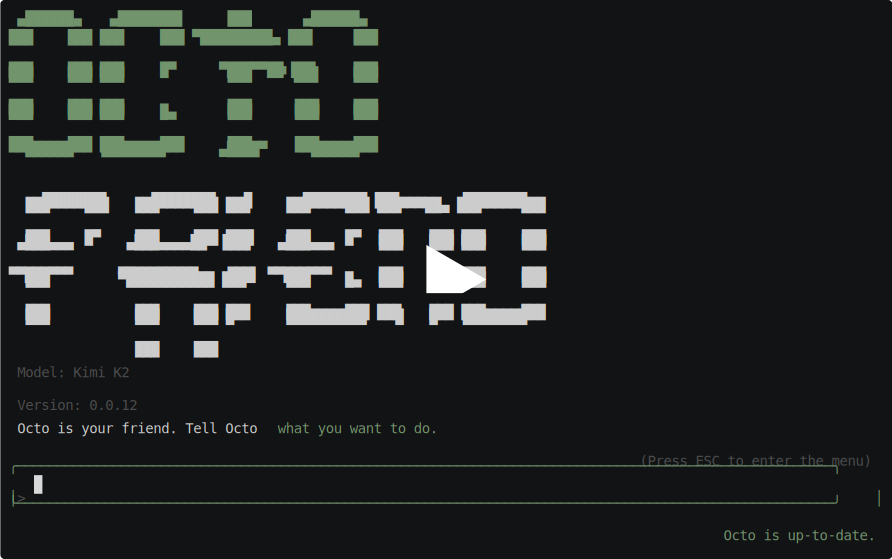

octofriend is the Bun-first TypeScript and Rust rewrite of Octofriend.
Octo is still your friend.

## Get Started

### Standalone installer

The standalone release includes `octofriend`, its `octo` alias,
`octofriend-acp`, and the native `octofriend-agentd` worker.

macOS and Linux with curl:

```bash
curl -fsSL https://raw.githubusercontent.com/xsyetopz/octofriend-next/rewrite/install.sh | sh
```

macOS and Linux with wget:

```bash
wget -qO- https://raw.githubusercontent.com/xsyetopz/octofriend-next/rewrite/install.sh | sh
```

Windows PowerShell 5.1 or newer:

```powershell
Invoke-WebRequest -UseBasicParsing https://raw.githubusercontent.com/xsyetopz/octofriend-next/rewrite/install.ps1 -OutFile install.ps1
powershell -ExecutionPolicy Bypass -File .\install.ps1
Remove-Item .\install.ps1
```

The installers verify the selected archive against the release
`SHA256SUMS`. Set `OCTO_VERSION` to install a specific version,
`OCTO_INSTALL_DIR` to choose a destination, or `OCTO_DOWNLOADER=curl|wget`
to force a Unix downloader.

### Package managers

Homebrew is hosted directly by this repository:

```bash
brew tap xsyetopz/octofriend-next https://github.com/xsyetopz/octofriend-next
brew install xsyetopz/octofriend-next/octofriend
```

Scoop is also hosted directly by this repository:

```powershell
scoop bucket add octofriend https://github.com/xsyetopz/octofriend-next
scoop install octofriend/octofriend
```

Each GitHub release contains a self-contained
`octofriend.<version>.nupkg`. Download it and use its directory as a
Chocolatey source:

```powershell
gh release download --repo xsyetopz/octofriend-next --pattern "octofriend.*.nupkg"
choco install octofriend --source . --yes
```

The Bun package remains available when a Bun-managed installation is preferred:

```bash
bun install --global octofriend
```

Then run:

```bash
octofriend
# or, for short:
octo
```

To try the current checkout without installing globally:

```bash
bun install
bun run exec
```

### Resume a conversation

Every interactive run prints a session ID and saves append-only conversation
revisions locally. Concurrent resumes preserve sibling branches, and resuming
selects the newest revision.
Resume it from the same working directory with:

```bash
octo --resume <session-id>
```

Octo restores the original config, permission mode, and local, Docker, or SSH
launch. Starting a new conversation with `/clear` creates a new session ID.
Use `/compact` during an interactive run to replace the current history with a
model-generated checkpoint without starting another assistant turn. Use
`/init [instructions]` to ask Octo to inspect the repository and create or update
its `OCTO.md` project guidance.

The automatic trigger defaults to 90% of the model context window and can be
changed in the config:

```json5
compaction: {
  autoThresholdPercent: 75,
  compactOldestPercent: 50,
}
```

To display shell tool stdout/stderr instead of only its line count, enable:

```json5
showShellOutput: true
```

Use `/metrics` to persistently toggle per-provider-request TTFT and output
token-rate summaries. The equivalent config value is `showProviderMetrics: true`;
it defaults to off.

Pre-fill a new interactive prompt without submitting it with:

```bash
octo --prefill "Investigate the failing test"
```

### Supported platforms

Octofriend is designed to run natively on Linux, macOS, and Windows. On
Windows, launch it from PowerShell or Command Prompt; Git Bash and WSL are not
required. Shell tools use `cmd.exe` and suppress the extra console windows that
Windows would otherwise create for each tool call.

For local proxy testing, copy `.env.template` to `.env`. The template points
OpenAI, Anthropic, Gemini, and Synthetic clients at `http://127.0.0.1:8080`
with `pwd` API keys so a local codex-proxy can exercise every provider path.


## About

octofriend is a small, helpful, cephalopod-flavored coding assistant that works with
OpenAI, Anthropic, Gemini, Synthetic, and compatible LLM APIs, and allows you to
switch models at will mid-conversation when a particular model gets stuck. OpenAI
setup supports ChatGPT OAuth or `OPENAI_API_KEY`; Gemini supports an API
key or OAuth/ADC, while Anthropic and Synthetic use API keys. Octo can
optionally use (and we recommend using)
ML models we custom-trained and open-sourced
([1](https://huggingface.co/syntheticlab/diff-apply),
[2](https://huggingface.co/syntheticlab/fix-json)) to automatically handle tool
call and code edit failures from the main coding models you're working with:
the autofix models work with any coding LLM. Octo works great with Kimi K2.5,
MiniMax M2.5, GPT-5.3, and Claude 4.6 (although pretty much any agentic
coding model will work). Octo wants to help you because Octo is your friend.

Octo has zero telemetry. Using Octo with a privacy-focused LLM provider (may we
selfishly recommend [Synthetic](https://synthetic.new)?) means your code stays
yours. But you can also use it with OpenAI-compatible providers, Anthropic,
Gemini, Synthetic, or local LLMs you run on your own machine.

## Authentication

Octofriend supports provider API keys and the official delegated credential
paths that the provider APIs expose:

- **OpenAI API:** set `OPENAI_API_KEY`.
- **ChatGPT subscription:** run `codex login`. Octofriend can reuse the
  official Codex login stored in `~/.codex/auth.json`, or a
  `CODEX_ACCESS_TOKEN`, through its `chatgpt-oauth` credential path.
  ChatGPT sign-in and API-key billing are separate choices; see
  [OpenAI's Codex authentication documentation](https://learn.chatgpt.com/docs/auth?surface=app).
- **Gemini API:** set `GEMINI_API_KEY`.
- **Gemini OAuth / Application Default Credentials:** provide a Google Cloud
  project and a command that prints a current access token. This is the
  official OAuth/ADC API path documented by
  [Google](https://ai.google.dev/gemini-api/docs/oauth); it uses Google Cloud
  project quota and is not a consumer Gemini subscription credential.
- **Anthropic:** use `ANTHROPIC_API_KEY`. Claude Max subscription credentials
  are intentionally not accepted outside Anthropic's Claude Code harness.

A durable Gemini ADC model entry looks like this in
`~/.config/octofriend/octofriend.json5`:

```json5
models: [
  {
    nickname: "Gemini with ADC",
    type: "gemini",
    baseUrl: "https://generativelanguage.googleapis.com/v1beta",
    model: "gemini-3.5-flash",
    auth: {
      type: "command",
      command: ["gcloud", "auth", "application-default", "print-access-token"],
      credential: "gemini-oauth",
      project: "your-google-cloud-project",
    },
  },
],
```

An environment variable containing a current access token also works:

```json5
auth: {
  type: "env",
  name: "GEMINI_ACCESS_TOKEN",
  credential: "gemini-oauth",
  project: "your-google-cloud-project",
},
```

The [Apps SDK authentication guide](https://developers.openai.com/apps-sdk/build/auth)
covers authenticating users of an MCP app. It does not turn an app user's
ChatGPT or Gemini account into a provider API credential.

## Agent Client Protocol

`octofriend-acp` is the duplex stdio ACP adapter. ACP clients can launch it
directly. It supports standard ACP session prompts, live assistant/thought/tool
updates, permission callbacks, per-session model selection, prompt cancellation, and
session cleanup. It uses the same Octofriend config and adjacent
`octofriend-agentd` worker as the interactive CLI; no private prompt method is
required.

### Zed

In Zed, run `agent: open settings`, choose **Add Agent** → **Add Custom
Agent**, and use the installed adapter:

```json
{
  "agent_servers": {
    "octofriend": {
      "type": "custom",
      "command": "octofriend-acp",
      "args": [],
      "env": {}
    }
  }
}
```

For development, point Zed at Bun and the checkout instead:

```json
{
  "agent_servers": {
    "octofriend-dev": {
      "type": "custom",
      "command": "bun",
      "args": [
        "/absolute/path/to/octofriend/packages/cli/src/acp/index.ts",
        "--config",
        "/absolute/path/to/octofriend.json5"
      ],
      "env": {}
    }
  }
}
```

Use `dev: open acp logs` in Zed to inspect the protocol stream. See
[Zed's External Agents documentation](https://zed.dev/docs/ai/external-agents)
for the current custom-agent settings contract.

## Enabling web search

By default, Octo will look for Synthetic API keys to use Synthetic's private,
zero-data-retention search API to power Octo's web search tool. If you have any
Synthetic models configured anywhere in Octo, Octo's search tool will Just
Work: even non-Synthetic-hosted models, like Claude, will be able to use Octo's
web search tool.

If you don't want to use Synthetic's search API, but you still want to use the
web search tool, you can configure the `search` config in
`~/.config/octofriend/octofriend.json5`:

```json5
{
  // ...the rest of your config,
  search: {
    url: "some_search_api_url",
    auth: { type: "env", name: "SOME_ENV_VAR_FOR_AUTH", credential: "api-key" },
  },
}
```

The search tool will make POST requests against the configured URL with the
following format, which is compatible with both Synthetic and
[Exa](https://exa.ai):

```javascript
{
  query: "some search query",
}
```

If you don't configure the `search` config, and you don't configure any
Synthetic API keys, Octo's harness will automatically hide the web search tool
so Octo doesn't try to call it.

## Demo

[](https://asciinema.org/a/728456)

## Sandboxing Octo

Octo has built-in support for Docker-compatible runtimes, including
[OrbStack](https://orbstack.dev/), and can attach to any container without
special configuration or image changes. To make Octo run inside an _existing_
container — for example, from Docker Compose — run `octo docker connect
your-container-name`.

To have Octo launch a container and remove it when Octo quits, run:

```bash
# Make sure to add the -- before the docker run args!
octo docker run -- ordinary-docker-run-args
```

For example, to launch Octo inside an Alpine Linux container:

```bash
octo docker run -- -d -i -t alpine /bin/sh
```

The runtime may pull an image that is not already available locally. To avoid
an implicit download, connect to an existing container or pass `--pull=never`
in the Docker arguments. Octo adds `--rm` to managed runs unless it is already
present, so stopped managed containers do not consume storage.

All of Octo shell commands and filesystem edits and reads will happen inside
the container. However, Octo will continue to use any MCP servers you have
defined in your config via your host machine (since the MCP servers are
presumably running on your machine, not inside the container), and will make
HTTP requests from your machine as well if it uses the built-in `fetch` tool,
so that you can use arbitrary containers that may not have `wget` or `curl`
installed.

## Rules

octofriend looks for active instruction files named like so:

- `AGENTS.md`
- `.agents/AGENTS.md`
- `CLAUDE.md`

`OCTO.md` is legacy documentation only and is not loaded as an active
instruction source.

octofriend searches from general to specific: the user config file, then each
parent directory down to the current directory. Directory-level `AGENTS.md`,
`.agents/AGENTS.md`, and `CLAUDE.md` files are merged in that order.

You can add a user-level rules file in `$XDG_CONFIG_HOME/AGENTS.md`, or in
`~/.config/AGENTS.md` when `XDG_CONFIG_HOME` is unset.

## Skills

Octo supports the [Agent Skills](https://agentskills.io/) spec for giving
reusable context-dependent instructions. If you want to give special
instructions for Octo to do code reviews, for example, you might write a code
review skill file, and Octo will intelligently load the skill when it needs to
do code reviews. You can find the full skill spec on the [Agent Skills
website](https://agentskills.io), but they're essentially just tagged Markdown
with optional scripts. Here's a very simple code review skill you might use:

```markdown
---
name: "pr-review"
description: "Review Github pull requests"
---

To load a Github pull request, run the fetch tool twice:

## First fetch

First, load the URL for the PR to understand the author's intent.

Your fetch tool does not execute JavaScript. Note that parts of the Github UI
may fail without JS; for example, loading comments might say:

    UH OH!
    There was an error while loading"

This is okay and expected. Don't worry about that.

## Second fetch: load the diff

To load the diff for the PR, fetch the PR URL with a `.diff`
attached to the end. For example, to review
`<pull-request-url>`, you should fetch:

`<pull-request-url>.diff`

The diff is the most important part. The author may be incorrect, or have the
right idea but the wrong implementation. Focus on whether there are any bugs or
unexpected behavior.
```

We automatically detect skills in the following places:

- `~/.config/agents/skills`, for global skill definitions
- `.agents/skills`, for skills relative to the current directory Octo is
  working in. For example, if your company has special guidelines for agents,
  you can distribute them with your company's repo in an `.agents/skills`
  directory.

If there are more directories you want Octo to discover skills from, you can
add them to your `~/.config/octofriend/octofriend.json5` config file like so:

```json5
skills: {
  paths: [
    // a list of directory paths containing skills
  ],
},
```

## Connecting Octo to MCP servers

Octo can do a lot out of the box — pretty much anything is possible with enough
Bash — but if you want access to rich data from an MCP server, it'll help Octo
out a lot to just provide the MCP server directly instead of trying to contort
its tentacles into crafting the right Bash-isms. After you run `octofriend` for
the first time, you'll end up with a config file in
`~/.config/octofriend/octofriend.json5`. To hook Octo up to your favorite MCP
server, add the following to the config file:

```json5
mcpServers: {
  serverName: {
    command: "command-string",
    args: [
      "arguments",
      "to",
      "pass",
    ],
  },
},
```

For example, to plug Octo into your Linear workspace:

```json5
mcpServers: {
  linear: {
    command: "npx",
    args: [ "-y", "mcp-remote", "https://mcp.linear.app/mcp" ],
  },
},
```

## Using Octo with local LLMs

If you're a relatively advanced user, you might want to use Octo with local
LLMs. Assuming you already have a local LLM API server set up like ollama or
llama.cpp, using Octo with it is super easy. When adding a model, make sure to
select `Add a custom model...`. Then it'll prompt you for your API base URL,
which is probably something like: `http://localhost:3000`, or whatever port
you're running your local LLM server on. After that it'll prompt you for an
environment variable to use as a credential; just use any non-empty environment
variable and it should work (since most local LLM server ignore credentials
anyway).

You can also edit the octofriend config directly in
`~/.config/octofriend/octofriend.json5`. The file path is kept for Octofriend
compatibility. Add the following to your list of models:

```json5
{
  nickname: "The string to show in the UI for your model name",
  baseUrl: "http://localhost:SOME_PORT",
  auth: { type: "env", name: "ANY_NON_EMPTY_ENV_VAR", credential: "api-key" },
  model: "The model string used by the API server, e.g. openai/gpt-oss-20b",
}
```

## Debugging

By default, Octo tries to present a pretty clean UI. If you want to see
underlying error messages from APIs or tool calls, run Octo with the
`OCTO_VERBOSE` environment variable set to any truthy string; for example:

```bash
OCTO_VERBOSE=1 octofriend
```

## Desktop notifications

There's a hidden "Notifications" menu that only appears if you've configured
desktop notifications. To configure desktop notifications, add a block like
this to your `octofriend.json5`:

```json5
notifications: {
  notifyCommand: "notify-send Octo 'Finished responding!'",
},
```

Or for macOS:

```json5
notifications: {
  notifyCommand: 'osascript -e \'display notification "Octo finished!"\'',
},
```

This enables the Notifications submenu in the main `ctrl-p` menu. You can set
it to the following three settings:

- Notify the next time Octo needs input
- Notify any time Octo needs input this session
- Always notify any time Octo needs input

The last option will be persisted to your config file, if you set it.

By default, for the session-level and persistent notifications, Octo will wait
10 seconds before notifying you, and if it receives input during that time
it'll skip the notification (so as to not spam you with notifications when
you're actively attending to it and chatting). To change the wait time, set:

```json5
notifications: {
  notifyCommand: "some command",
  notifyTimeoutMs: 20000, // Or however many milliseconds you want to wait
},
```

## Opting into canary versions

If you want to use unreleased versions of octofriend, clone this repo and source
`canary.sh`, `canary.fish`, or `canary.ps1`. Bash and fish install
`canary-octofriend`, with `canary-octo` retained as a shell alias. PowerShell
installs `Invoke-Canaryoctofriend` and a `canary-octo` alias. All three run the
checkout directly with `octofriend_CHANNEL=canary`.
